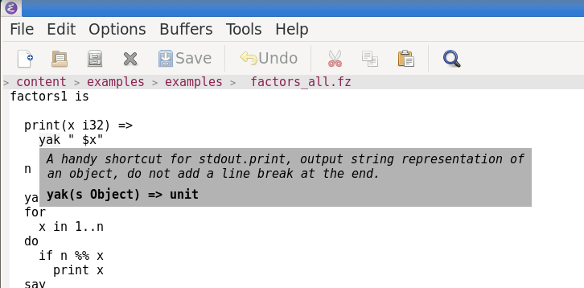

#  A language server implementation for Fuzion

## Requirements
- java version 17 or higher
- GNU-Make
- wget

## Build
- run `make jar` which should produce an **out.jar** file
- run the artifact via `java out.jar [options]`

### Transport socket
- run `./bin/fuzion_language_server -socket --port=3000`
- connect the client to the (random) port the server prints to stdout.

### Transport stdio
- run `./bin/fuzion_language_server -stdio`

## Debug
- `make debug`

## Test
- `make run_tests`

## Profiling
- clone https://github.com/jvm-profiling-tools/async-profiler
- add the profiler.sh script to PATH
- `make profile/tests` or `profile/tagged_tests`

## Clients
|Client|Repository|
|---|---|
|vscode|https://github.com/tokiwa-software/vscode-fuzion|
|vim|see instructions below|
|emacs|see instructions below|
|eclipse (theia)|https://github.com/tokiwa-software/vscode-fuzion|

### Vim


0) Note: fuzion_language_server (from ./bin/) needs to be in $PATH

1) Example .vimrc:
    ```vim
    :filetype on

    call plug#begin('~/.vim/plugged')
    Plug 'neoclide/coc.nvim', {'branch': 'release'}
    call plug#end()
    ```
2) in vim

    1) `:PlugInstall`

    2) `:CocConfig`

          ```json
          {
            "languageserver": {
              "fuzion": {
                "command": "fuzion_language_server",
                "args" : ["-stdio"],
                "filetypes": [
                  "fz",
                  "fuzion"
                ]
              }
            }
          }
          ```

3) add filetype-detection file ~/.vim/ftdetect/fz.vim
    ```vim
    au BufRead,BufNewFile *.fz            set filetype=fz
    ```

### Emacs



- Note: fuzion_language_server (from ./bin/) needs to be in $PATH
- install lsp-mode, flycheck and company for emacs using
    - M-x package-install RET lsp-mode
    - M-x package-install RET flycheck
    - M-x package-install RET company RET
- add the following code to ~/.emacs.d/fuzion-lsp.el to enable [https://github.com/emacs-lsp/lsp-mode](lsp-mode)

```elisp
(require 'package)
(add-to-list 'package-archives '("melpa" . "https://melpa.org/packages/") t)
(add-to-list 'package-archives '("elpa" . "https://elpa.gnu.org/packages/"))
(package-initialize)
(custom-set-variables
 ;; custom-set-variables was added by Custom.
 ;; If you edit it by hand, you could mess it up, so be careful.
 ;; Your init file should contain only one such instance.
 ;; If there is more than one, they won't work right.
 '(inhibit-startup-screen t)
 '(package-selected-packages '(lsp-ui company flycheck lsp-mode ##)))
(custom-set-faces
 ;; custom-set-faces was added by Custom.
 ;; If you edit it by hand, you could mess it up, so be careful.
 ;; Your init file should contain only one such instance.
 ;; If there is more than one, they won't work right.
 )

(define-derived-mode fuzion-mode
  fundamental-mode "Fuzion"
  "Major mode for Fuzion.")

(add-to-list 'auto-mode-alist '("\\.fz\\'" . fuzion-mode))

(require 'lsp-mode)
(global-flycheck-mode)
(add-to-list 'lsp-language-id-configuration '(fuzion-mode . "fuzion"))

(defgroup lsp-fuzionlsp nil
  "LSP support for Fuzion, using fuzionlsp."
  :group 'lsp-mode
  :link '(url-link ""))

(lsp-register-client
 (make-lsp-client :new-connection (lsp-stdio-connection "fuzion_language_server -stdio")
                  :major-modes '(fuzion-mode)
                  :priority -1
                  :server-id 'fuzionls))


(lsp-consistency-check lsp-fuzion)

(add-hook 'fuzion-mode-hook #'lsp)
(add-hook 'after-init-hook 'global-company-mode)

(provide 'lsp-fuzion)

(provide 'init)
;;; init.el ends here
```

- add following line to ~/.emacs.d/init.el or to ~/.emacs

  (load "~/.emacs.d/fuzion-lsp.el")

## Implementation state

|Feature|Status|
|---|---|
|diagnostics|☑|
|completion|☑|
|hover|☑|
|signatureHelp|☑|
|declaration|☐|
|definition|☑|
|typeDefinition|☐|
|implementation|☐|
|references|☑|
|documentHighlight|☐|
|documentSymbol|☑|
|codeAction|☐|
|codeLens|☐|
|documentLink|☐|
|documentColor|☐|
|colorPresentation|☐|
|formatting|☐|
|rangeFormatting|☐|
|onTypeFormatting|☐|
|rename|☑|
|prepareRename|☑|
|foldingRange|☐|
|selectionRange|☐|
|prepareCallHierarchy|☐|
|callHierarchy incoming|☐|
|callHierarchy outgoing|☐|
|semantic tokens|☑|
|linkedEditingRange|☐|
|moniker|☐|
|inlayHints|☑|
|inlineValue|☐|
|type hierarchy|☐|
|notebook document support|☐|
